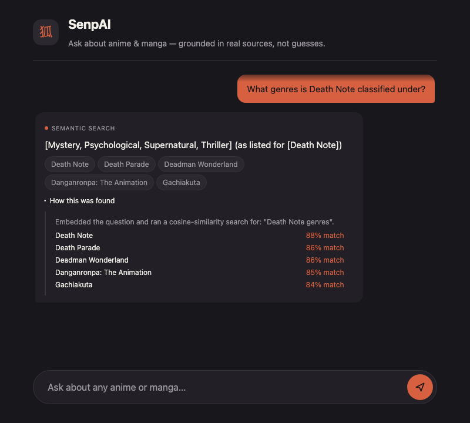
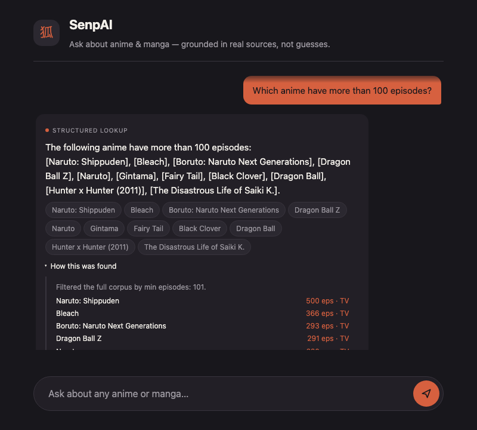

# SenpAI

[](https://github.com/sandeepparmar3006/senpai/actions/workflows/ci.yml)
[](LICENSE)

RAG assistant over anime/manga metadata with a **function-calling tool router** — every answer streams token-by-token, is grounded in retrieved sources, and ships a collapsible panel showing exactly which retrieval path it took and why.

**Live demo: [senpai-seven.vercel.app](https://senpai-seven.vercel.app)**

| Semantic route | Structured route |
|---|---|
|  |  |

Both screenshots show the **"How this was found" panel** expanded — collapsed by default, it exposes the router's actual decision (search query embedded, or filter criteria applied) and per-source retrieval detail, so the retrieval mechanics are inspectable, not just asserted in this README.

## Why a router

Top-k similarity search silently fails on whole-corpus questions: "which anime have more than 150 episodes?" needs to scan all 250 rows, not the 5 most similar chunks. So the model picks a tool per question via real function-calling (`tool_choice: required`), not a manual classifier prompt:

- `semantic_search` — embed the query, pgvector `match_media_chunks()` RPC (plot/synopsis questions)
- `filter_lookup` — `filter_media()` SQL RPC over all rows (genre/episode/format filters, lists, counts)

One production detail worth knowing: open-weight models sometimes emit a hallucinated answer in `message.content` *alongside* the real `tool_calls`. The implementation discards `content` and only trusts the executed tool result.

## Eval results

22 hand-labeled questions (8 metadata, 12 plot, 2 structured), run through the **same router as production** by `eval/eval.py`:

| Stage | Route match | Retrieval hit | Answer match |
|---|---|---|---|
| Pre-router (semantic-only baseline) | — | 100% | 100% |
| Router added | 82% | 77% | 77% |
| After router fix (`45c27b5`) | 100% | 100% | 100% |

Adding the router improved real correctness (structured questions get accurate whole-corpus answers instead of top-5 guesses) but introduced routing error as a new, measurable failure surface. The eval caught two reproducible failure modes:

1. Plot questions occasionally misrouted to `filter_lookup` ("what creatures devour humans in Attack on Titan" was classified as structured and returned nothing).
2. `filter_lookup` sometimes extracted wrong or empty arguments ("which anime are movies" didn't pass `format: "MOVIE"`).

Both traced to the same root cause: tool descriptions didn't state the disambiguation rule (named-title plot question wins even when phrased as "what X") and the `format` param had no enum. Fixed both, re-ran the eval unchanged: 100/100/100. That re-run is a regression check validating those two fixes — the next step is a larger held-out set the fixes weren't tuned against, to test generalization.

Two smaller findings from repeat runs, kept because they're what eval work actually looks like:

- **Routing is sampled**, so route match occasionally drops a question run-to-run (21/22 observed on one re-run). Single-run numbers on N=22 carry real variance.
- **One "failure" was a scoring bug, not a model bug**: the model emitted a U+202F narrow no-break space inside "Pirate King", which broke exact substring matching. `keyword_hit()` now normalizes unicode whitespace, with a regression test in `tests/test_eval.py`.

### Held-out eval (45 unseen questions)

`eval/qa_pairs_holdout.json`: 45 new questions (28 semantic with fresh phrasing, 17 structured with ground truth computed from the raw corpus) written after the router fix and never used to tune it. `python eval/eval.py eval/qa_pairs_holdout.json`:

| Run | Route match | Retrieval hit | Answer match |
|---|---|---|---|
| First run | 100% (45/45) | 93% (42/45) | 93% (42/45) |
| After tool-schema fix | 98% (44/45) | 98% (44/45) | 96% (43/45) |

The 100% route match on unseen phrasing is the evidence the earlier disambiguation fix generalizes. The first run also surfaced two new argument-extraction bugs, both in `filter_lookup`: the model passed lowercase genres ("sports") against a case-sensitive jsonb match, and the format description omitted `TV_SHORT` so the model couldn't express it. Fixed the same way as before — `enum` constraints on both params — and verified against the live RPC.

The three remaining misses are reported, not patched: one correct answer rejected by strict keyword scoring ("a single punch" vs. expected "one punch"), one run-to-run route flip that still retrieved the right titles, and one generation-stage misread of the retrieved context. Tuning the held-out set until it hits 100% would defeat its purpose.

## Architecture

```
AniList GraphQL (isAdult: false filtered at fetch time)
        |
   ingest/fetch_anilist.py       -> data/raw_anilist.json
        |
   ingest/chunk_and_embed.py     -> data/embedded.json
        | (Together AI embeddings, intfloat/multilingual-e5-large-instruct, 1024-dim)
   ingest/load_to_supabase.py    -> Supabase pgvector table
        |
   api/chat.js (Vercel function)
        | check_rate_limit() RPC -> per-IP (15/min) + global (1000/day) cap, fail-open
        | route(query) -> Together chat completion w/ tools (openai/gpt-oss-20b), tool_choice: required
        |   |-- semantic_search  -> embed query -> match_media_chunks() RPC (returns cosine similarity)
        |   |-- filter_lookup    -> filter_media() RPC
        | streamGenerate(question, route_results) -> Together chat completion, stream: true
        |   -> answer piped to the client as SSE tokens as they're generated
   public/ (chat UI: renders tokens live, shows route + retrieval detail per answer)
```

Corpus is SFW: the AniList fetch query hard-filters `isAdult: false`, so adult-tagged entries never enter the pipeline.

Model note: `BAAI/bge-*` embeddings and `meta-llama/Llama-3.3-*-Free` chat models are catalog-listed on Together but require a paid dedicated endpoint — the models above were confirmed serverless-accessible by testing directly against the API.

**Production hardening**: this is a public URL calling a paid LLM per request with no auth — a real abuse/wallet-drain surface, not a hypothetical one. `check_rate_limit()` (`supabase/rate_limit.sql`) enforces a per-IP cap (15/min) and a global daily ceiling (1000/day) via an atomic Postgres upsert, shared across all serverless instances (in-memory counters reset on every cold start, so they don't work here). It fails open — a `rate_limits` outage degrades to unlimited rather than breaking chat.

## Setup

1. **Supabase**: create a project, run `supabase/schema.sql` and `supabase/rate_limit.sql` in the SQL editor. Grab the project URL + service role key (Settings > API).
2. **Together AI**: sign up at https://api.together.xyz, generate an API key (free-tier credits).
3. Copy `.env.example` to `.env` (ingestion) and `.env.local` (Vercel), fill in `TOGETHER_API_KEY`, `SUPABASE_URL`, `SUPABASE_SERVICE_KEY`.
4. `pip install -r requirements.txt`
5. `python ingest/run_ingest.py --pages 5` (5 pages x 50 = 250 anime entries)
6. `python eval/eval.py` — routes every question through the production router, prints route/retrieval/answer rates.
7. `npm install && vercel dev` locally, `vercel --prod` to deploy.

## Roadmap

- ~~Held-out eval set~~ — done, see "Held-out eval" above.
- ~~Streaming responses + rate limiting~~ — done, see "Architecture" and "Production hardening" above.
- Jikan/MyAnimeList reviews as a second text source for opinion-based questions.

## License

MIT
